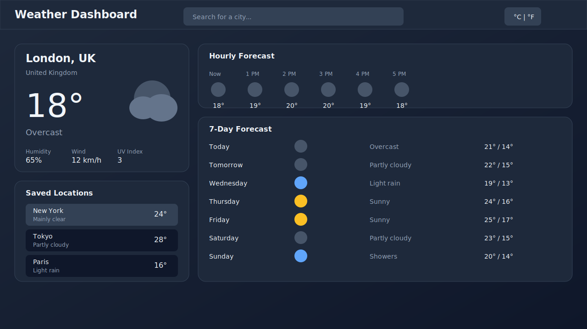

# Weather Dashboard

A modern, production-ready weather dashboard built with Next.js 16, TypeScript, and Tailwind CSS.



[](https://github.com/YOUR_USERNAME/weather-app/actions/workflows/ci.yml)


## Features

- **Real-time Weather** - Current conditions, 24-hour hourly, and 7-day forecasts
- **Server-side API** - Weather data fetched via `/api/weather` route with caching and rate limiting
- **Demo Mode** - Works without any API keys using deterministic demo data
- **Mobile-first Design** - Responsive layout optimized for all screen sizes
- **Accessibility** - Full keyboard navigation, ARIA labels, screen reader support
- **Dark Mode** - Automatic theme detection with manual toggle

## Quick Start

```bash
# Clone and install
git clone <your-repo-url>
cd weather-app
npm ci

# Run development server
npm run dev
```

Open [http://localhost:3000](http://localhost:3000) to view the dashboard.

## Zero-secret quickstart (demo mode)

Run the app without any API keys using deterministic demo data:

```bash
npm ci
cp .env.example .env.local
npm run dev
```

**Demo behavior:** With `WEATHER_API_MODE=demo`, the app serves stable weather data for London, New York, Tokyo, Paris, and Sydney. To switch to live Open-Meteo data, remove `WEATHER_API_MODE` (or set it to any value other than `demo`).

## Scripts

| Script              | Description                  |
| ------------------- | ---------------------------- |
| `npm run dev`       | Start development server     |
| `npm run build`     | Create production build      |
| `npm start`         | Start production server      |
| `npm run lint`      | Run ESLint                   |
| `npm run typecheck` | Run TypeScript type checking |
| `npm test`          | Run unit tests (Vitest)      |
| `npm run test:e2e`  | Run E2E tests (Playwright)   |
| `npm run format`    | Format code with Prettier    |

## Demo Mode

The app works out-of-the-box without any API keys. By default, it uses [Open-Meteo](https://open-meteo.com/), a free weather API.

For testing or demos, set `WEATHER_API_MODE=demo` to use deterministic demo data:

```bash
# .env.local
WEATHER_API_MODE=demo
```

Demo mode provides stable data for 5 cities: London, New York, Tokyo, Paris, Sydney.

## Environment Variables

| Variable           | Required | Default | Description                               |
| ------------------ | -------- | ------- | ----------------------------------------- |
| `WEATHER_API_MODE` | No       | (none)  | Set to `demo` for deterministic demo data |

**Note:** No API keys are required. Open-Meteo is free and keyless.

## Architecture

```
User → UI → /api/weather → Provider → Response
                 ↓
            Cache (5-min TTL)
            Rate Limit (30 req/min)
```

The frontend calls `/api/weather` which:

1. Validates request with Zod schemas
2. Checks in-memory cache (5-minute TTL)
3. Applies rate limiting (30 requests/minute per IP)
4. Fetches from provider (Open-Meteo or Demo)
5. Returns structured JSON response

See [docs/ARCHITECTURE.md](./docs/ARCHITECTURE.md) for detailed architecture documentation.

## Project Structure

```
weather-app/
├── src/
│   ├── app/
│   │   ├── api/weather/      # Server API route
│   │   ├── page.tsx          # Dashboard
│   │   └── settings/         # Settings page
│   ├── components/
│   │   ├── ui/               # Base components (Button, Card, Input)
│   │   └── weather/          # Weather components
│   ├── lib/
│   │   └── weather/          # Provider pattern + cache + schemas
│   ├── services/             # Client API calls
│   └── types/                # TypeScript types
├── e2e/                      # Playwright E2E tests
├── docs/                     # Documentation
└── .github/workflows/        # CI/CD
```

## Testing

```bash
# Unit tests (Vitest)
npm test

# E2E tests (Playwright)
npm run test:e2e

# E2E with UI
npm run test:e2e:ui
```

Test coverage:

- **32 unit tests** - Zod schemas, demo provider, cache behavior
- **13 E2E tests** - UI flows, API routes, accessibility

## Deploy to Vercel

[](https://vercel.com/new)

### Vercel Configuration

| Setting          | Value           |
| ---------------- | --------------- |
| Framework Preset | Next.js         |
| Build Command    | `npm run build` |
| Output Directory | `.next`         |
| Install Command  | `npm ci`        |
| Node.js Version  | 20.x            |

### Environment Variables (Vercel)

No environment variables required for production. Optionally set:

- `WEATHER_API_MODE=demo` for demo mode

### Deployment Steps

1. Push code to GitHub
2. Import repository in Vercel
3. Deploy (auto-detected as Next.js)

## Local Development Checklist

Verify everything works:

```bash
npm ci              # Install dependencies
npm run lint        # ✓ No errors
npm run typecheck   # ✓ No errors
npm test            # ✓ 32 tests pass
npm run build       # ✓ Build succeeds
```

## How to verify

Run the demo quickstart:

```bash
npm ci
cp .env.example .env.local
npm run dev
```

Run the verification commands:

```bash
npm run lint
npm run typecheck
npm test
npm run build
```

## Technology Stack

- **Framework**: Next.js 16 (App Router)
- **Language**: TypeScript 5
- **Styling**: Tailwind CSS 4
- **Validation**: Zod
- **Testing**: Vitest + Playwright
- **Icons**: Lucide React
- **CI/CD**: GitHub Actions

## Contributing

1. Fork the repository
2. Create a feature branch
3. Make your changes
4. Run `npm run lint && npm run typecheck && npm test`
5. Submit a pull request

## License

MIT License - see [LICENSE](./LICENSE) for details.

## Acknowledgments

- Weather data by [Open-Meteo](https://open-meteo.com/)
- Built with [Next.js](https://nextjs.org/)
- Styled with [Tailwind CSS](https://tailwindcss.com/)
- Icons from [Lucide](https://lucide.dev/)
